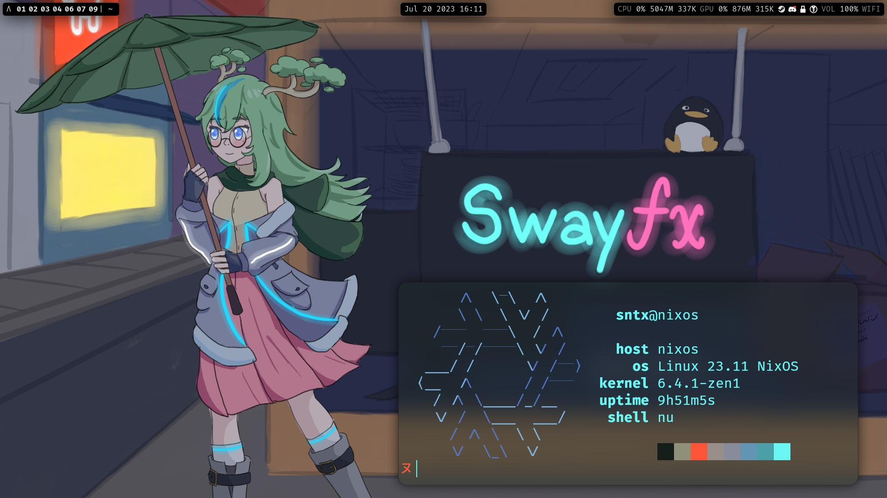

# SwayFX: A Beautiful Sway Fork



Sway is an incredible window manager, and certainly one of the most well established wayland window managers. However, it is restricted to only include the functionality that existed in i3. This fork ditches the simple wlr_renderer, and replaces it with our fx_renderer, capable of rendering with fancy GLES2 effects. This, along with a couple of minor changes, expands sway's featureset to include the following:

+ **Anti-aliased rounded corners, borders, and titlebars**
+ **Per application saturation control**: Allows the user to set the saturation (Digital Vibrance) for specific applications. Great for some FPS games!
+ **Scratchpad treated as minimize**: Allows docks, or panels with a taskbar, to correctly interpret minimize / unminimize requests ([thanks to LCBCrion](https://github.com/swaywm/sway/issues/6457))
+ **Add a nix flake to the repo**: Allows nixos users to easily contribute to and test this project

## New Configuration Options

+ Corner radius: `corner_radius <val>`
+ Application saturation: `for_window [CRITERIA HERE] saturation <set|plus|minus> <val 0.0 <-> 2.0>`

## Roadmap

+ fade in / out animations
+ window movement animations
+ drop shadows
+ blur

## Installation

### Nix

If you have Nix installed, you can build and run SwayFX easily:

```
nix build
./result/bin/sway
```

You can also bring up a development shell and follow the build instructions below, without installing all of the dependencies manually:

```
nix develop
```

### Compiling from Source

Install dependencies:

* meson \*
* wlroots
* wayland
* wayland-protocols \*
* pcre
* json-c
* pango
* cairo
* gdk-pixbuf2 (optional: system tray)
* [scdoc] (optional: man pages) \*
* git (optional: version info) \*

_\* Compile-time dep_

Run these commands:

    meson build/
    ninja -C build/
    sudo ninja -C build/ install

On systems without logind nor seatd, you need to suid the sway binary:

    sudo chmod a+s /usr/local/bin/sway

SwayFX will drop root permissions shortly after startup.

## Contributing

SwayFX would love to receive any new features that you're willing to build! Generally, we'd like to focus on eye-candy type improvements to keep our scope appropriate. If you'd like to build something that you think may be out of that focus, please raise an issue and we can discuss whether or not it will fit within this project.

Here's a quick outline of where most of our changes lie vs the main sway repository:
+ `sway/desktop/render.c`: the file that handles calling `fx_renderer` to render to the screen, handles damage tracking and scaling
+ `sway/desktop/fx_renderer.c`: the meat and potatoes of this project, structured as similarly to wlr_renderer as possible
+ `sway/desktop/shaders`: where all of the shaders that fx_renderer uses live

Please join our (for the time being very small) Discord server for development chatter! https://discord.gg/jVjjFdcN

